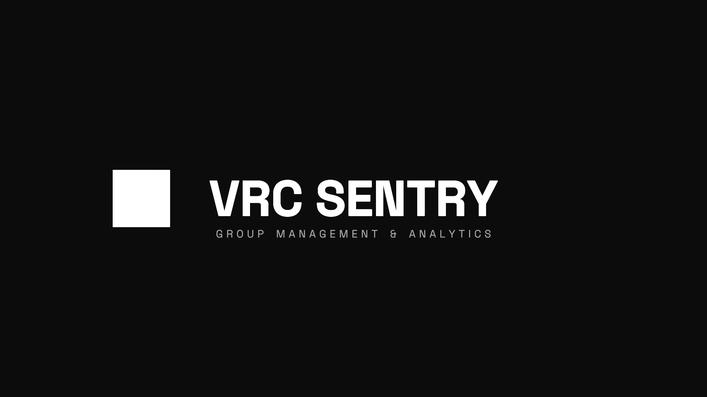

<h1 align="center">🛡️ VRC-Sentry</h1>

  

> *Ever wished managing your VRChat group didn't feel like a second full-time job?*

**VRC-Sentry** is a free, open-source dashboard that unites your staff, tracks instance activity, and organizes moderation history in one clean, shared space.

---

## ⚠️ Project Status: Alpha Development

> [!WARNING]
> **VRC-Sentry is currently in active development.** Features are actively being built, refined, and tested. You may encounter bugs, breaking changes, or incomplete functionality as the project evolves.

---

## 🤝 Become a Tester

If you manage a large VRChat community and want to help shape the future of VRC-Sentry, let's connect! I am currently looking for testers and offer two ways to collaborate:

### 🛠️ Deployment Assistance

Want to try the dashboard with your team? I can personally walk you through the configuration and help you get it fully deployed.

### 📊 Data Testing

Willing to help stress-test the system? You can share anonymized group data to help test the dashboard's performance under heavy loads - no ongoing access to your group required.

---

### 💬 Interested?

**Hit me up!** Reach out if you want to get involved, need help with setup, or can lend some data to the cause.
